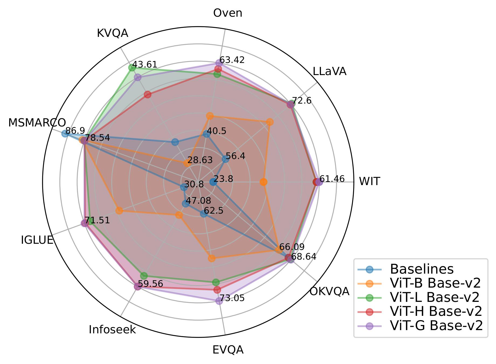

# Model Zoo

For the huggingface implementation, we provide four pre-trained checkpoints of FLMR and PreFLMR models. 

# PreFLMR

**Deprecation Note**: the results shown above are slightly affected by the conversion of checkpoints. Please see the most up-to-date benchmark results in the [main page](../README.md)

PreFLMR is pretrained on WIT, CC3M, MSMARCO, KVQA, LLaVA, OVEN, OKVQA, Infoseek and E-VQA datasets. For details on the split for training and evaluation, hyperparameter used for training the PreFLMR models, please refer to the paper [PreFLMR: Scaling Up Fine-Grained Late-Interaction Multi-modal Retrievers](https://arxiv.org/abs/2402.08327). Here, we release three pre-trained checkpoints:

| Model   | Vision Encoder | Text Encoder | Checkpoint Name   | No. Param. | WIT   | LLaVA  | OVEN  | KVQA  | IGLUE | Infoseek | E-VQA | OKVQA | MSMARCO |
|---------|----------------|--------------|-------------------------------------------------------------|-------|-------|--------|-------|-------|-------|----------|-------|--------|-------|
| PreFLMR | ViT-B          | Base-v2      | [LinWeizheDragon/PreFLMR_ViT-B](https://huggingface.co/LinWeizheDragon/PreFLMR_ViT-B) | 327M | 41.7  | 67.2   | 46.3  | 28.6  | 57.3  | 48.8 | 67.9 | 66.1 | 79.5 |
| PreFLMR | ViT-L          | Base-v2      | [LinWeizheDragon/PreFLMR_ViT-L](https://huggingface.co/LinWeizheDragon/PreFLMR_ViT-L) | 543M | 60.5  | 71.8   | 59.8  | 43.6  | 69.2  | 57.9 | 70.8 | 68.5 | 78.7 |
| PreFLMR | ViT-G          | Base-v2      | [LinWeizheDragon/PreFLMR_ViT-G](https://huggingface.co/LinWeizheDragon/PreFLMR_ViT-G) | 2.1B | 61.5  | 72.4   | 63.4  | 42.1  |71.5  | 59.6 | 73.1 | 68.6 | 78.6 |

For the evaluation metrics, WIT uses Recall@10, IGLUE uses Recall@1, all the rest datasets use Recall@5 or Pseudo Recall@5 (for EVQA, OKVQA, and Infoseek). 

The ViT-B is initialized from `openai/clip-vit-base-patch32`, ViT-L is initialized from `openai/clip-vit-large-patch14-336` and ViT-G is initialized from `laion/CLIP-ViT-bigG-14-laion2B-39B-b160k`. The ViT is frozen during the pretraining of PreFLMR. Base-v2 text encoder refer to the base-sized BERT model from [ColBERTv2](https://github.com/stanford-futuredata/ColBERT). 

    
  PreFLMR outperforms baseline on all nine benchmarks except for the text-only MSMARCO task.

# FLMR

We provide FLMR checkpoints in addition to the PreFLMR checkpoints. The FLMR is from the paper [Fine-grained Late-interaction Multi-modal Retrieval for Retrieval Augmented Visual Question Answering](https://arxiv.org/abs/2309.17133). The mapping network of FLMR is pre-trained with the subset of WIT which contains about 200K image-text pairs. FLMR uses `openai/clip-vit-base-patch32` as the vision encoder and the same Base-v2 ColBERTv2 as the text encoder. The FLMR checkpoint is at [LinWeizheDragon/FLMR](https://huggingface.co/LinWeizheDragon/FLMR).
